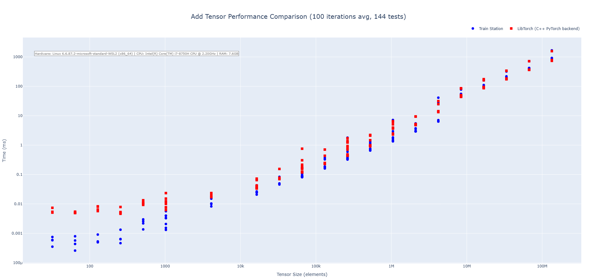
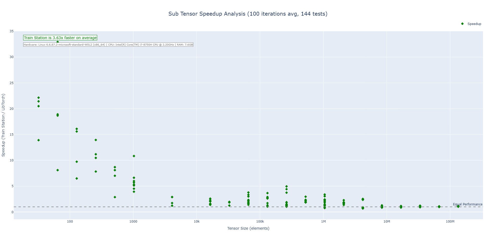
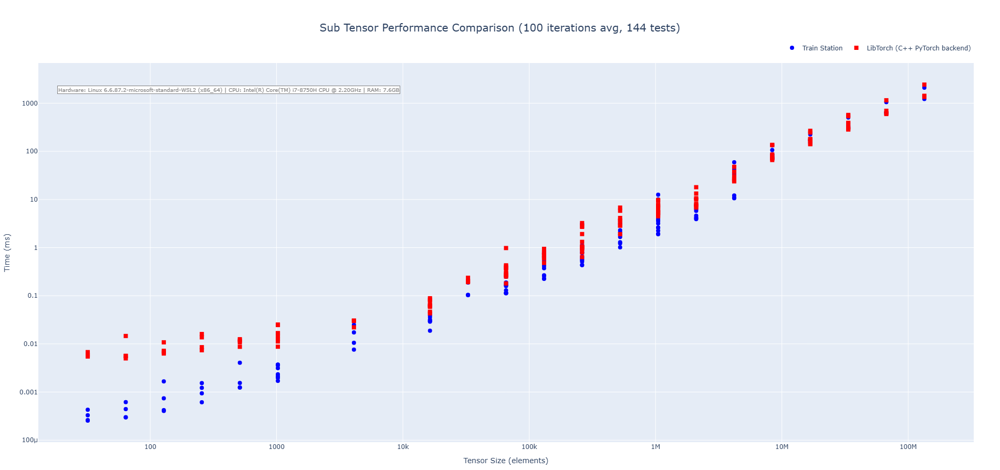
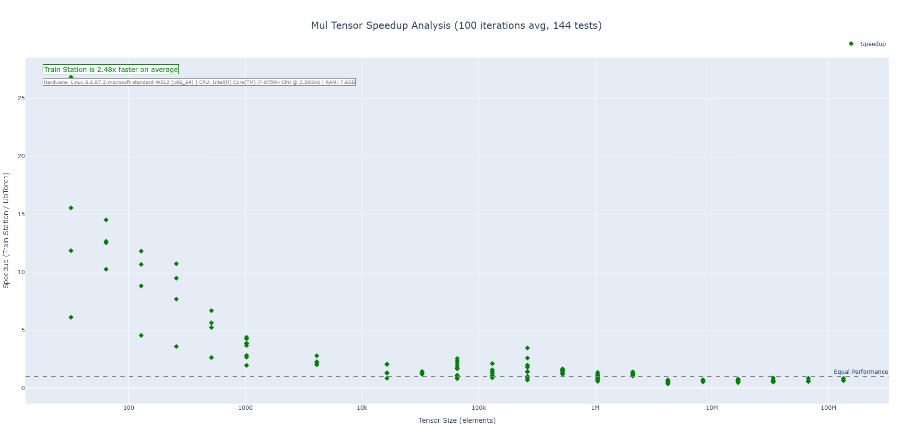
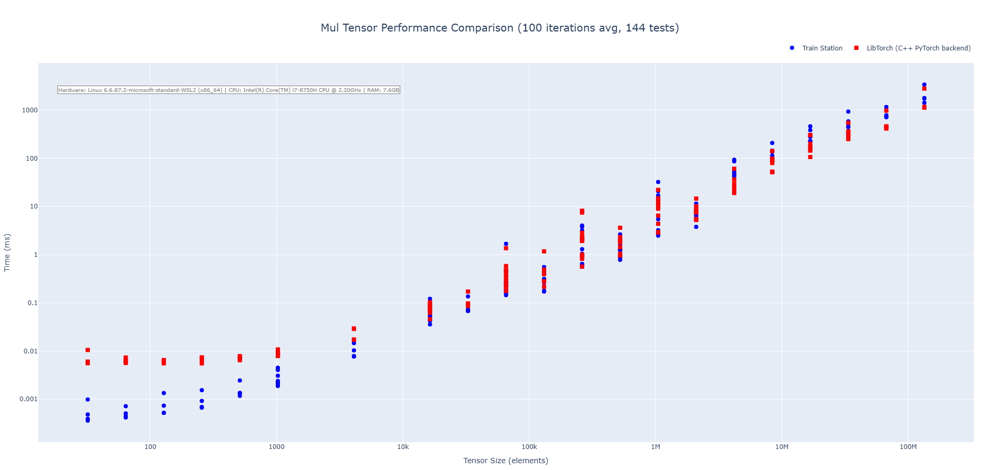
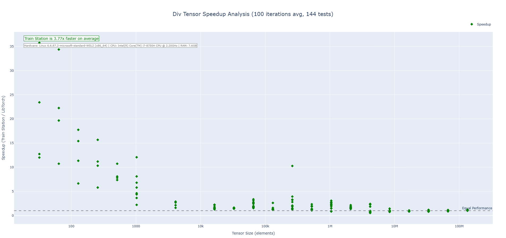
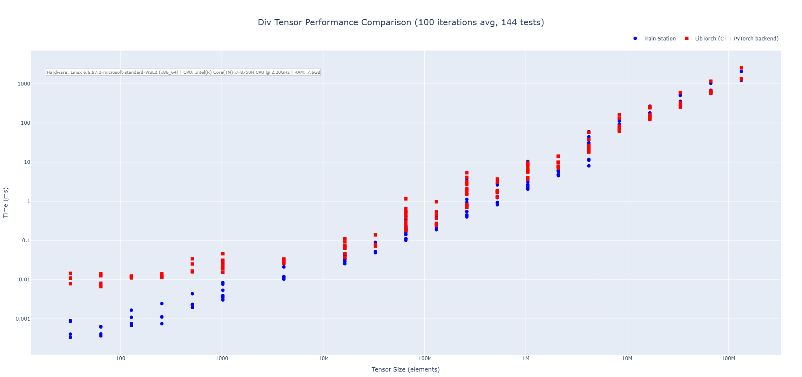
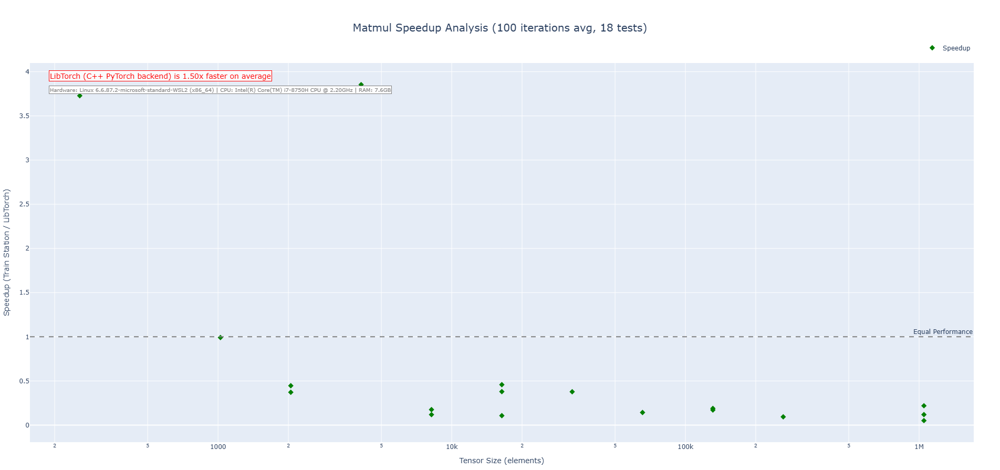
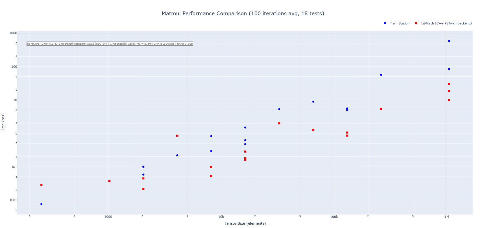

# Train Station - Test

> A zero-dependency, PyTorch inspired maximum performance Rust machine learning library.

## What's Train Station?

Train Station is a from-scratch ML framework designed for lightweight production workflows (think embedded applications or edge deployments). Built with zero external dependencies and a focus on zero-cost abstractions, it provides PyTorch-like ergonomics while maintaining complete control over performance. Train Station aims to encourage first-principles thinking and ground-up research. It provides the tooling to construct industry standard architectures and layers as well as completely novel architectures and techniques.  

Due to the zero dependency nature, building across various platforms and distrubution should be a breeze. The days of having to move around various dynamically linked objects or dealing with FFI boundary support and error handling are gone with this library.

With this said, the project is in its infancy, and we plan on rapidly expanding operation support, functionality, and eventually adding CUDA support (also, please report any bugs discovered so that we can patch things up as quickly as possible). Feel free to help contribute as we expand functionality and support!

Why "Train Station"? Simplicity, familiarity, performance, ease of use.

## Key Features

### Performance First
- **Zero dependencies** - Just Rust and raw performance
- **SIMD everywhere** - AVX2 acceleration for all major operations
- **Cache-friendly** - Memory layouts optimized for modern CPUs
- **Proven fast** - Benchmarked against LibTorch with impressive results
- **Iterator Itegration** - Our Tensor ties into the vast Iterator ecosystem while maintaining gradtrack auto differentiation. 

### Readiness
- **Thread-safe** - Safe concurrent execution by design
- **LibTorch-tested** - Every operation validated against LibTorch
- **Ergonomic API** - Familiar patterns

## Performance Results

Base performance seems solid - with signifigant speedups compared to LibTorch (C++ PyTorch backend) on certain ops. With this said, it will be hard to match performance for all operations considering our zero-dependency design (talking BLAS, MKL which larger behemoth libraries leverage). Our aim is to out-perform the competition. As the project matures we will continue to persue increasing levels of performance. 

### Performance Benchmarks

#### Addition Operation (CPU)



Train Station's addition operation showcases performance across tensor sizes with particularly impressive results on small to medium tensors where our zero-overhead approach shines. We are 2-3X faster on average across the benchmarks run. 

#### Subtraction Operation (CPU)



Train Station's subtraction operation showcases performance across tensor sizes with particularly impressive results on small to medium tensors where our zero-overhead approach shines. We are 3-4X faster on average across the benchmarks run. 

#### Multiplication Operation (CPU)



Train Station's multiplication operation showcases performance across tensor sizes with particularly impressive results on small to medium tensors where our zero-overhead approach shines. We are 2-3X faster on average across the benchmarks run. 

#### Division Operation (CPU)



Train Station's division operation showcases performance across tensor sizes with particularly impressive results on small to medium tensors where our zero-overhead approach shines. We are 3-4X faster on average across the benchmarks run. 

#### Matrix Multiplication (CPU)



Train Station's matmul operation shows increased performance at the very bottom end, but end up being slower on average than LibTorch (hard to compete with LibTorch's handcrafted matmul kernels and decades of MKL and BLAS library refinement). We are exploring ways to get this benchmark up without adding async operations. 

## Quick Start

```rust
use train_station::{Tensor, Device, Adam};

// Create tensors - familiar API for PyTorch users
let x = Tensor::randn(vec![32, 784], None);
let w = Tensor::randn(vec![784, 128], None).with_requires_grad();
let b = Tensor::zeros(vec![128]).with_requires_grad();

// Forward pass - it's that simple
let y = x.matmul(&w).add_tensor(&b).relu();

// Automatic differentiation - because we've got your backward
let loss = y.sum();
loss.backward(None);

// Optimize - Adam optimizer with all the bells and whistles
let mut optimizer = Adam::new();
optimizer.add_parameters(&[&w, &b]);
optimizer.step(&mut [&mut w, &mut b]);
```

## Architecture

Train Station is built on three core principles:

1. **Performance**: Every line of code is written with speed in mind. Unsafe Rust? Yes, but only where benchmarks justify it, and always validated for correctness.

2. **Simplicity**: No unnecessary abstractions. KISS approach applied. We try to avoid rediculously complex and unmaintainable semantics. 

3. **Correctness**: Extensive validation against LibTorch ensures mathematical equivalence. We're fast, but we also want to be accurate.

## What's in the Box (will be expanding this rapidly)?

### Core Operations **(see docs for full list of ops)**
- **Arithmetic**: `add`, `sub`, `mul`, `div` with full broadcasting
- **Activations**: `relu`, `leaky_relu`, `sigmoid`, `tanh`, `softmax`
- **Matrix ops**: `matmul` with optimized kernels
- **Reductions**: `sum`, `mean`, `min`, `max`, `std`, `var`, `norm`
- **Transformations**: `reshape`, `permute`, `transpose`, `squeeze`, `unsqueeze`

### Automatic Differentiation
- Dynamic computation graphs
- Gradient accumulation
- Mixed precision ready
- Memory efficient backward passes

### Optimizers
- Adam with AMSGrad variant
- Full state serialization
- Learning rate scheduling ready

### Device Management
- Transparent CPU/GPU operations
- Thread-safe context switching
- Zero-overhead abstractions

## Installation

 <mark>**WARNING** - 
**CUDA FEATURE UNSTABLE, ACTIVATION NOT RECCOMMENDED AT THIS TIME**<mark/>      

Add to your `Cargo.toml`:

```toml
[dependencies]
train-station = "0.1"

# Optional features - CUDA support imcomplete, just a place holder to showcase
train-station = { version = "0.1", features = ["cuda"] }
```

## Roadmap

### Near Term
- Rapid expansion of operation support
- Focus on building block functionality
- Mature the functionality and listen to user feedback

### On the Horizon  
- More complex objects (various layer types, more complex operations and loss functions)
- CUDA support

## Contributing

We welcome contributions that improve performance, add features, or enhance documentation. Before submitting PRs:

- Run benchmarks to ensure no performance regressions
- Add tests for new functionality
- Validate against LibTorch for correctness
- Keep the zero-dependency promise

## License

Licensed under either:
- Apache License, Version 2.0 ([LICENSE-APACHE](LICENSE-APACHE))
- MIT license ([LICENSE-MIT](LICENSE-MIT))

at your option.

## Acknowledgments

Train Station's design is inspired by PyTorch's excellent API. We stand on the shoulders of giants - PyTorch pioneered the patterns that make deep learning accessible. We're just making them faster in Rust.

Special thanks to the Rust ML community for showing us what's possible.

---

*Built for speed. Validated for correctness. Build, break, fix, innovate, repeat. Keep moving forward.*